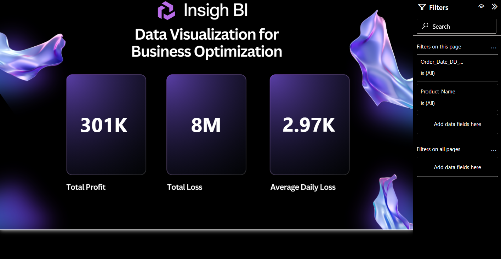

# 🏭 Production Analytics Dashboard using MySQL, SQL Server and Power BI


---

## 📌 Project Overview

This project presents an **end-to-end production analytics dashboard** built with **Power BI**, using **MySQL** and **SQL Server** as relational data sources.

The project combines:
- 🛢️ **MySQL** — Initial data source, SQL extraction & transformation
- 🗄️ **SQL Server** — Secondary data source & ETL continuation
- 📊 **Power BI** — Interactive business intelligence dashboards
- ☁️ **Power BI Service** — Cloud deployment for online access & sharing

> The dataset was processed through two database environments to simulate a real-world scenario where the source system changed mid-project — without interrupting reporting continuity.

---

## 🎯 Project Objectives

This project answers key business questions such as:

- Which product has the highest demand vs availability gap?
- What is the total supply shortage across all products?
- How much loss is caused by unmet demand?
- Which products are generating profit vs loss?
- How do demand and availability trend over time?
- What is the average daily demand and availability per product?

---

## 📊 Dashboard Screenshots

### 1. Overview Dashboard


### 2. Production Cost Analysis


---

## 🛠️ Tools & Technologies

| Tool | Purpose |
|---|---|
| MySQL | Initial data source & SQL querying |
| SQL Server | Secondary data source & ETL continuation |
| Power BI Desktop | Dashboard development & data modeling |
| DAX | Custom KPI measures & calculations |
| Power BI Service | Cloud publishing & sharing |
| Excel | Data validation & quick inspection |

---

## ⚙️ Setup & Usage

### Step 1 — Clone the Repository
```bash
git clone https://github.com/abhi14324/production-analytics-dashboard.git
cd production-analytics-dashboard
```

### Step 2 — Set Up MySQL Database
```sql
-- Run the MySQL script
use prod;
-- Execute mysql.txt queries to create and populate new_table
```

### Step 3 — Set Up SQL Server Database
```sql
-- Run the SQL Server script
CREATE DATABASE Production;
USE Production;
-- Execute SQLQuery1.sql to clean data and create new_table
```

### Step 4 — Open Power BI Dashboard
1. Open `Production_Analytics_Dashboard.pbix` in Power BI Desktop
2. Click **Home → Transform Data** and update the database connection strings
3. Click **Refresh** to load the latest data
4. Explore all dashboard pages using the slicers and filters

---

## 📁 Project Structure

```
production-analytics-dashboard/
│
├── dataset/
│   ├── Products.csv                            ← Product lookup table (20 products)
│   └── Test_Environment_Inventory_Dataset.csv  ← Inventory dataset (99 rows)
│
├── sql_queries/
│   ├── mysql.txt                               ← MySQL extraction queries
│   └── SQLQuery1.sql                           ← SQL Server cleaning & ETL queries
│
├── dax_measures/
│   └── measures.txt                            ← All DAX measures used in Power BI
│
├── screenshots/
│   ├── overview_dashboard.png
│   └── production_cost_analysis.png
│
├── Production_Analytics_Dashboard.pbix         ← Power BI dashboard file
└── README.md
```

---

## 📋 Dataset Description

The dataset contains **99 inventory records** with **6 columns** across two joined tables:

### Inventory Table (`Test_Environment_Inventory_Dataset.csv`)

| Column | Description |
|---|---|
| Order Date | Date of the production order (DD/MM/YYYY) |
| Product ID | Unique product identifier (1–20) |
| Availability | Units available in stock |
| Demand | Units demanded |

### Products Table (`Products.csv`)

| Column | Description |
|---|---|
| Product ID | Unique product identifier |
| Product Name | Name of the product (20 products) |
| Unit Price ($) | Selling price per unit |

### Final Joined Table (`new_table`)

| Column | Description |
|---|---|
| Order_Date_DD_MM_YYYY | Cleaned order date |
| Product_ID | Product identifier |
| Availability | Stock available |
| Demand | Units demanded |
| Product_Name | Product name (from Products table) |
| Unit_Price | Unit selling price (from Products table) |

---

## 🔄 Why Both MySQL and SQL Server Were Used

This project reflects a practical reporting scenario where source systems changed during the reporting lifecycle.

### Initial Phase — MySQL
The production dataset was first extracted and processed through MySQL. Queries were written for source connection, table joining, and initial data preparation.

### Later Phase — SQL Server
SQL Server was introduced when the reporting source changed. The dashboard was reconnected to SQL Server, demonstrating real-world adaptability across two relational database environments inside Power BI.

---

## 💡 Key Business Logic

### Loss / Profit Calculation

```
LOSS/PROFIT column = Availability - Demand

If LOSS/PROFIT > 0 → Surplus  → Profit recognized
If LOSS/PROFIT < 0 → Shortage → Loss incurred
If LOSS/PROFIT = 0 → Neutral  → No impact
```

### Total Profit
```
Total Profit = SUM of (LOSS/PROFIT × Unit_Price) where LOSS/PROFIT > 0
```

### Total Loss
```
Total Loss = SUM of (LOSS/PROFIT × Unit_Price) × -1 where LOSS/PROFIT < 0
```

### Supply Shortage
```
Total Supply Shortage = Total Demand − Total Availability
```

---

## 📈 Power BI Dashboards

### Dashboard 1 — Overview Dashboard
> Demand vs Availability and supply gap overview

**KPI Cards:** Average Demand Per Day · Average Availability Per Day · Total Supply Shortage

**Filters:**
- Order Date slicer
- Product Name filter

**Key Insights:**
- 📦 Average daily demand (48.65) is nearly **2× average daily availability** (24.70)
- ⚠️ Total supply shortage stands at **61K units** — a major operational gap
- 📅 Date and product-level filtering enables granular performance review

---

### Dashboard 2 — Production Cost Analysis
> Financial impact of supply shortage — profit vs loss breakdown

**KPI Cards:** Total Profit · Total Loss · Average Daily Loss

**Key Insights:**
- 💰 Total Profit generated: **301K**
- 📉 Total Loss incurred: **8M** — approximately **26× the profit**
- 🔻 Average Daily Loss: **2.97K** — signals a critical supply chain problem
- ❗ The loss-to-profit ratio highlights urgent need for supply improvement

---

## 📐 Key DAX Measures

```DAX
-- Total Availability
Total Availability = SUM('Demand/Availability Data'[availability])

-- Total Demand
Total Demand = SUM('Demand/Availability Data'[demand])

-- Total Supply Shortage
Total Supply Shortage = [Total Demand] - [Total Availability]

-- Total Number of Days
Total Number of Days = DISTINCTCOUNT('Demand/Availability Data'[Order_Date_DD_MM_YYYY].[Date])

-- Average Demand Per Day
Average Demand Per Day = DIVIDE([Total Demand], [Total Number of Days])

-- Average Availability Per Day
Average Availability Per Day = DIVIDE([Total Availability], [Total Number of Days])

-- Total Profit
Total Profit = SUMX(
    FILTER('Demand/Availability Data', 'Demand/Availability Data'[LOSS/PROFIT] > 0),
    'Demand/Availability Data'[LOSS/PROFIT] * 'Demand/Availability Data'[unit_price]
)

-- Total Loss
Total Loss = SUMX(
    FILTER('Demand/Availability Data', 'Demand/Availability Data'[LOSS/PROFIT] < 0),
    'Demand/Availability Data'[LOSS/PROFIT] * 'Demand/Availability Data'[unit_price]
) * -1

-- Average Loss Per Day
Average Loss Per Day = DIVIDE([Total Loss], [Total Number of Days])
```

---

## 🔍 Key Findings

| # | Finding | Result |
|---|---|---|
| 1 | Average Demand Per Day | 48.65 units |
| 2 | Average Availability Per Day | 24.70 units |
| 3 | Total Supply Shortage | 61K units |
| 4 | Total Profit | 301K |
| 5 | Total Loss | 8M |
| 6 | Average Daily Loss | 2.97K |
| 7 | Loss-to-Profit Ratio | ~26× (critical) |
| 8 | Total Products Tracked | 20 products |
| 9 | Database Sources Used | 2 (MySQL + SQL Server) |
| 10 | Demand vs Availability Gap | Demand is ~2× Availability |

---

## ☁️ Power BI Service Deployment

The dashboard has been published to **Power BI Service** for cloud access.

**View Live Dashboard:** [🔗 Click here to open in Power BI Service](https://app.powerbi.com/groups/ceca6bd6-257b-43a6-ad35-d6d3777a9e4d/reports/18a1ede7-6352-40ad-8914-d38dacdd789b/6864a5f1dfbee684d28e?experience=power-bi)

Power BI Service enables:
- 🌐 Online dashboard access from any device
- 🔗 Easy report sharing with stakeholders
- 🔄 Scheduled data refresh capability
- 📱 Mobile-friendly dashboard viewing
- 👔 Executive-level presentation ready

---

## 🚀 Future Improvements

- [ ] Add more dashboard pages with product-level trend charts
- [ ] Add demand forecasting using Python or R integration
- [ ] Connect to a live database for real-time refresh
- [ ] Add RLS (Row-Level Security) for multi-user access
- [ ] Add supplier and procurement tracking module
- [ ] Expand dataset to cover full production lifecycle

---

## 👤 Author

**Abhishek Kumar**

[](https://linkedin.com/in/abhishek-kumar-a53b46309)
[](https://github.com/abhi14324)
[](mailto:ak38022246637@gmail.com)

---

## 📄 License

This project is open source and available under the [MIT License](LICENSE).

---

> ⭐ If you found this project helpful, please give it a star on GitHub!
